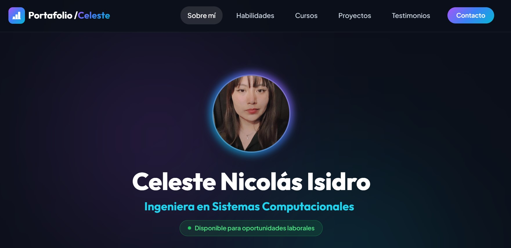

# 📊 Portafolio Profesional — Celeste Nicolás Isidro

Bienvenido/a al repositorio oficial de mi **Portafolio Web Profesional**. Este sitio está diseñado con una estética **Dark Glassmorphism** moderna, interactiva y responsive, orientada a destacar mi perfil como **Analista de Datos Jr.** y **Soporte Técnico IT**, respaldada por mi formación en **Ingeniería en Sistemas Computacionales**.

🔗 **Sitio Web en Vivo:** [celestenis.github.io](https://celestenis.github.io)

---

## 🌟 Características Principales

- 🎨 **Estética Dark Glassmorphism**: Diseño oscuro de alta gama con tarjetas semi-transparentes (`backdrop-filter: blur`), gradientes neón y contraste optimizado para una excelente legibilidad.
- 📱 **Totalmente Responsive**: Maquetación adaptada para dispositivos móviles, tablets y monitores de escritorio.
- ⚡ **Interacciones Dinámicas**:
  - Efecto *Typewriter* animado con rotación de roles profesionales.
  - *Scroll Reveal* suave mediante `IntersectionObserver`.
  - Copiado rápido de correo electrónico al portapapeles con confirmación visual (*Toast*).
  - Indicador pulsante de disponibilidad laboral.
- 📜 **Sección de Cursos Desplegable (*Collapsible*)**: Bloque interactivo para visualizar certificaciones y formación continua sin saturar la navegación.

---

## 🛠️ Tecnologías & Herramientas

### 📊 Análisis de Datos & Soporte IT (Áreas Principales)

### 💻 Web Development & Scripting (Hobby / Habilidad Adicional)

---

## 📂 Estructura del Portafolio

1. **Sobre mí (Hero Section)**: Presentación profesional, descarga directa de CV en PDF, badge de disponibilidad laboral y enlaces a redes.
2. **Habilidades & Tech Stack**:
   - *Análisis de Datos & Bases de Datos*: SQL, Python (Pandas), Excel Avanzado, Power BI.
   - *Soporte Técnico & Sistemas IT*: Diagnóstico Hardware/Software, Mantenimiento PC, Windows/Linux, Redes.
   - *Desarrollo Web & Herramientas*: HTML5, CSS3, JavaScript, Git, Tecnolochicas PRO.
   - *Fortalezas Profesionales*: Pensamiento analítico, troubleshooting, atención al usuario.
3. **Cursos & Certificaciones (Desplegable)**: Formación continua en Tecnolochicas PRO, ITT y capacitaciones técnicas.
4. **Proyectos & Desarrollos Prácticos**: Muestra de aplicaciones interactivas con manejo de datos, persistencia en almacenamiento local e infraestructura básica.
5. **Testimonios**: Recomendaciones y valoraciones de colegas académicos.
6. **Contacto**: Módulo directo para envío de mensajes y botón de copiar correo en un clic.

---

## 📸 Vista Previa

---

## 📬 Contacto & Redes

- **Correo Electrónico:** [celeztenicolaz@gmail.com](mailto:celeztenicolaz@gmail.com)
- **LinkedIn:** [linkedin.com/in/celestenicolas](https://www.linkedin.com/in/celestenicolas/)
- **GitHub:** [github.com/celestenis](https://github.com/celestenis)
- **Facebook:** [facebook.com/celeztenicolaz](https://www.facebook.com/celeztenicolaz)

---

Creado por <strong>Celeste Nicolás Isidro</strong> — Estudiante de Ing. en Sistemas Computacionales (ITT) & Alumna Tecnolochicas PRO 💗

